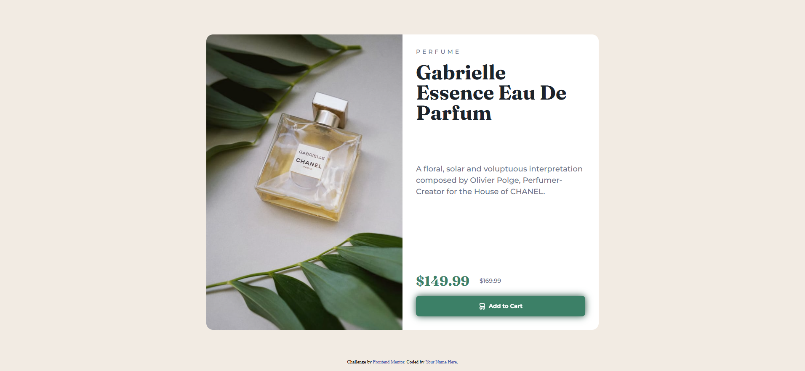

# Frontend Mentor - Product preview card component solution

This is a solution to the [Product preview card component challenge on Frontend Mentor](https://www.frontendmentor.io/challenges/product-preview-card-component-GO7UmttRfa). Frontend Mentor challenges help you improve your coding skills by building realistic projects.

## Table of contents

- [Overview](#overview)
  - [The challenge](#the-challenge)
  - [Screenshot](#screenshot)
  - [Links](#links)
- [My process](#my-process)
  - [Built with](#built-with)
  - [What I learned](#what-i-learned)
  - [Continued development](#continued-development)
- [Author](#author)

## Overview

### The challenge

Users should be able to:

- View the optimal layout depending on their device's screen size
- See hover and focus states for interactive elements

### Screenshot



### Links

- Solution URL: [https://github.com/david-franca/product-preview-card](https://github.com/david-franca/product-preview-card)
- Live Site URL: [https://product-preview-card-five-kappa.vercel.app/](https://product-preview-card-five-kappa.vercel.app/)

## My process

### Built with

- Semantic HTML5 markup
- CSS custom properties
- Flexbox
- CSS Grid
- Mobile-first workflow

### What I learned

How to use images depending on the user's screen size.

This way:

```html
<picture>
  <source
    media="(min-width: 1200px)"
    srcset="images/image-product-desktop.jpg"
  />
  <source media="(min-width: 375px)" srcset="images/image-product-mobile.jpg" />
  
</picture>
```

### Continued development

There are many ways to find and use a solution. Mine is not the best. I need to study to find more ways to achieve the same goal.

## Author

- Website - [David França](https://davidfranca.vercel.app/)
- Frontend Mentor - [@david-franca](https://www.frontendmentor.io/profile/david-franca)
